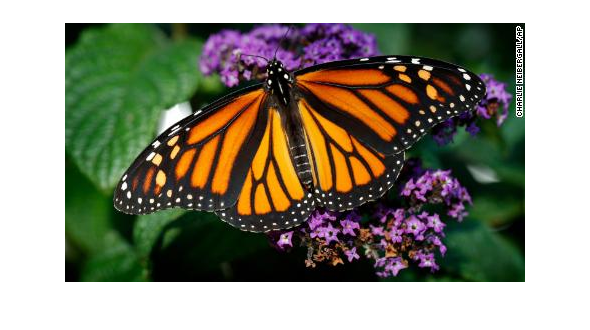
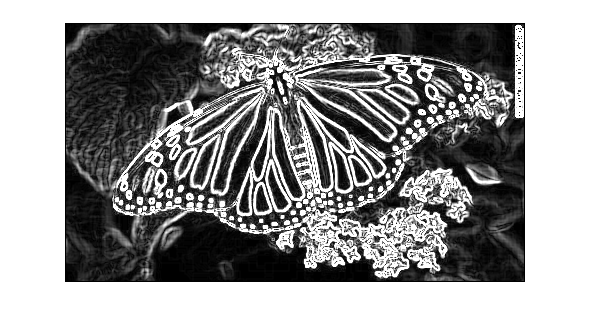

<!DOCTYPE html
<body>
<h1>Edge detection using custom C code</h1><!--introduction-->
Using mex functions, custom C code can be written and then used in MATLAB
<!--/introduction--><h2>Contents</h2>
<ul><li><a href="#1">Import image</a></li><li><a href="#2">Convert image to gray scale</a></li><li><a href="#3">Call custom C sobel edge detection code</a></li><li><a href="#4">Threshold image</a></li></ul>
<h2 id="1">Import image</h2><pre class="codeinput">img = imread('butterfly.jpg');
imshow(img, []);
</pre> <h2 id="2">Convert image to gray scale</h2><pre class="codeinput">grayImg = rgb2gray(img);
im = double(grayImg);
imshow(im, []);
</pre> <h2 id="3">Call custom C sobel edge detection code</h2><pre class="codeinput">imsize = int32(size(im));
C_edgeDetectedImg = edgeDetection_mex(im, imsize);
imshow(C_edgeDetectedImg, []);
</pre><pre class="codeoutput">Running custom edge detection code...

</pre> <h2 id="4">Threshold image</h2><pre class="codeinput">threshImg = C_edgeDetectedImg &gt; 240;
imshow(threshImg, []);
</pre> 
 <a href="https://www.mathworks.com/products/matlab/">Published with MATLAB&reg; R2019b</a> 

</body></html>
